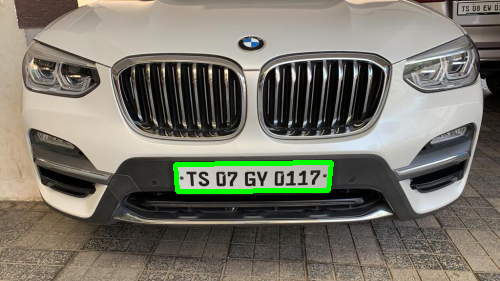
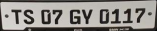

# 🅿 Vehicle Number Plate Recognition

A Python-based application for detecting and recognizing vehicle number plates in images (and optionally video), using computer vision and OCR techniques.

---

##  Features

-  Detects license plate regions in images using [OpenCV / YOLO / other] object detection  
-  Extracts text from detected plates using Tesseract OCR (or other libraries)  
-  Supports [image formats, video streams, etc.]  
-  Returns recognized text along with optional bounding box info  
-  [Optional] Graphical interface or CLI for ease of use  
-  [Optional] Save results to file (image with boxes, extracted text, CSV, etc.)

---

##  Project Structure

Vehile-numberplate-recognition/
│── detect.py # Detection (and recognition) script
│── requirements.txt # Python dependencies
│── models/ # Pretrained detection model(s)
│── utils.py # Helper functions (image loading, drawing boxes)
│── README.md # (You’re here!)
│── examples/ # Sample input/output files
└── [other files]

## Sample Input

The input is a 3 channel RGB image and the output is the license plate number stored in a text file.

This is the input image 
 

## Sample Output

This is the image with number plate marked on the image 
 

This is the image of the number plate extracted from it
  

1.To run the code run main.py and give filepath and image name as input

2.The final output is stored in plate_number.txt file in Cropped_Image_text folder

2.You can also see the intermediate results stored in the Cropped_Image folder

## Requirements

Python 3.x

OpenCV (opencv-python)

Tesseract (pytesseract)

[YOLO / other detection model dependencies]

Any other libraries like numpy, Pillow, etc.

## Contributing

Contributions are welcome! Please fork the repo and submit a pull request. For major changes, open an issue first to discuss your plans.